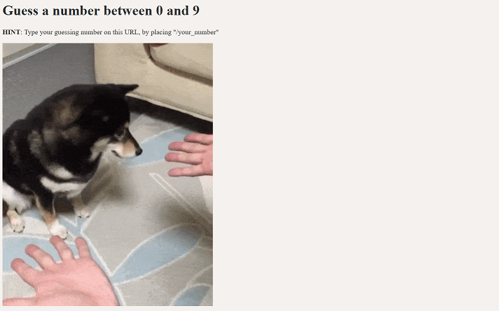

_English. Português._

# Flask: Guessing Game (Higher-Lower)

A **very simple** guess-the-number game with Flask Python.

The code here is mininum but enough to grasp the idea.

### Note
*Here's the thing: I was learning a bit about Flask, very introductory things, and was taking notes on it. I do this 
so I can come back to it later in whatever case I might need to refresh my memory. This very simple guess-the-number 
game was actually an exercise on this course I'm taking - you know, as a way to settle the content a little bit. So 
here it is. The course is from Dr. Angela Yu's Python Bootcamp and [my notes are here](https://github.com/barbaracalderon/notes-on-python/blob/main/05_FLASK.md).*

## Points

The point here is about:

1. To learn what is Flask
2. How to work with route variables
3. To make debug=True
4. To insert HTML tags
5. To complete the exercise

The point here is not about:

1. A beautiful HTML piece of work
2. UX/UI
3. An actual application to go live on the web

## Run `server.py`

You should see the entrance. 

Keep guessing the number as suggested in "HINT".

Try it yourself by changing the pictures or the content design.

---

# Flask: jogo do adivinhar um número com Flask Python.

O código aqui na verdade é mínimo mas o suficiente para captar a ideia da coisa.

### Nota
_Negócio é o seguinte: eu tava aprendendo Flask, coisas bem introdutórias mesmo, as tava fazendo anotações sobre 
isso. Eu faço essas coisas para poder voltar no futuro, caso eu precise refrescar a memória por algum motivo. Esse 
jogo é extremamente simples e foi um exercício nesse bootcamp que eu me propus a fazer - um exercício pra dar uma 
fixada no conteúdo. Então tá aqui. O curso é o Dr. Angela Yu's Python Bootcamp e [as minhas notas de Python] estão 
aqui também. 

## Considerações

O ponto aqui é sobre:

1. Aprender o que é Flask
2. Como trabalhar com roteamento de variáveis
3. Como fazer debug=True
4. Como inserir tags HTML com Python
5. Completar o exercício

O ponto aqui não é sobre:

1. Um trabalho lindão de HTML
2. UX/UI
3. Uma aplicação real para ir para a web viver no mundo

## Roda o arquivo `server.py`

E você deve ver a entrada.

Continue adivinhando o jogo assim como descrito no campo "HINT" conforme imagem ilustrativa. O campo HINT na verdade 
diz o seguinte: "digite o número da sua escolha nessa URL, colocando depois da barra /seu_numero"

Tente por si mesmo e troque as imagens do jogo ou o design da tela.